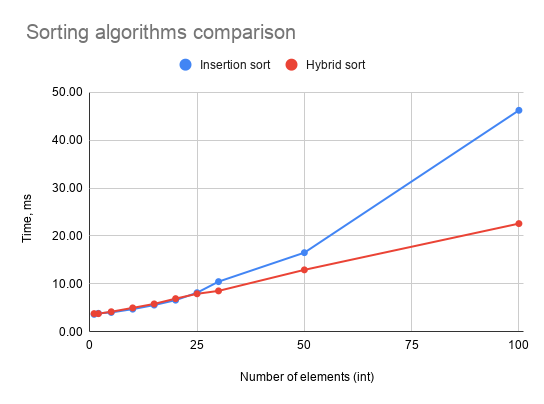
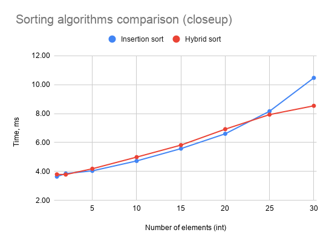

# Quicksort
A modification of Hoarse's partition algorithm. Pivot is 
calculated as a median of the first, last and middle elements.
After partition the smaller subarray is processed recursively, while
the larger part is sorted iteratively. 

### Features
- Makes use of templates
- Move semantics are applied to sort elements where possible
- Google Tests

INSERTION_THRESHOLD is the parameter used to switch the sorting algorithm 
to insertion sort when processing a smaller quantity of data. It's used 
to avoid the overhead of implemented hybrid algorithm when appropriate.

Below are the plotted results of benchmarking, which were used to determine the threshold.

